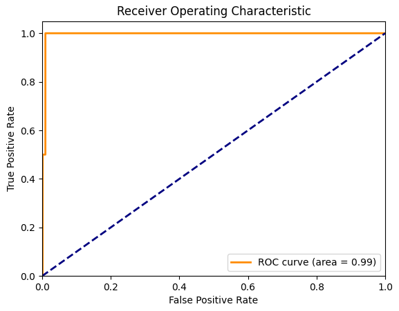
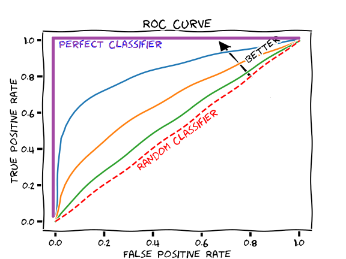
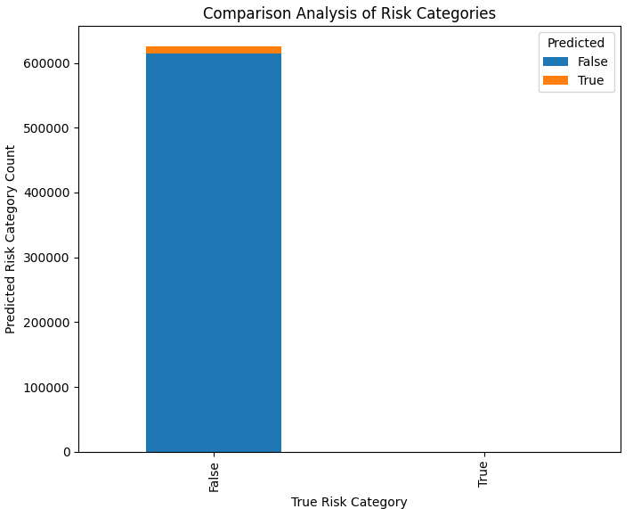

# Logistic Regression Model for RBA

- Carlos Segarra

## Handling Large Data and Stratified Sampling

`app/data_preparation/__init__.py`: line 70

```python
    def perform_stratifed_sampling(self, df: pd.DataFrame, target: str) -> pd.DataFrame:
        """Perform stratified sampling on the dataset

        Args:
            df (pd.DataFrame): The DataFrame to perform stratified sampling
            target (str): The target column for stratified sampling

        Returns:
            pd.DataFrame: The stratified sample
        """
        _, sample_df = train_test_split(df, test_size=self.sample_percent, stratify=df[target], random_state=42)
        return sample_df
```

### Feature Engineering

`app/main.py`: line 14

```python
features = ['Country', 'Device Type', 'Is Attack IP', 'Is Account Takeover', 'Login Timestamp']
```

`app/data_preparation/__init__.py`: line 83

```python
    def convert_timestamp(self, df: pd.DataFrame, timestamp_col: str) -> pd.DataFrame:
        """Convert timestamp to datetime and extract useful temporal features

        Args:
            df (pd.DataFrame): The DataFrame to convert timestamp
            timestamp_col (str): The column containing the timestamp

        Returns:
            pd.DataFrame: The DataFrame with converted timestamp
        """
        df[timestamp_col] = pd.to_datetime(df[timestamp_col])
        df['Hour'] = df[timestamp_col].dt.hour
        df['Day of Week'] = df[timestamp_col].dt.dayofweek
        df.drop(timestamp_col, axis=1, inplace=True)
        return df
```

`app/data_preparation/__init__.py`: line 99

```python
    def reduce_cardinality(self, df: pd.DataFrame, column: str, threshold: int) -> pd.DataFrame:
        """Reduce the cardinality of a column by grouping infrequent values into 'Other'

        Args:
            df (pd.DataFrame): The DataFrame containing the column
            column (str): The column to reduce cardinality
            threshold (int): The threshold below which values are grouped into 'Other'

        Returns:
            pd.DataFrame: The DataFrame with reduced cardinality
        """
        counts = df[column].value_counts()
        other = counts[counts < threshold].index
        df.loc[df[column].isin(other), column] = 'Other'
        return df
```

### Model Training

`app/logistic_regression/__init__.py`: line 56

```python
#...
from sklearn.linear_model import LogisticRegression
from sklearn.model_selection import GridSearchCV

# ...

    def train_model(self, X_train: pd.DataFrame, y_train: pd.Series) -> LogisticRegression:
        """ Train the logistic regression model with parameter tuning

        Args:
            X_train (pd.DataFrame): DataFrame of features
            y_train (pd.Series): Series of target values

        Returns:
            LogisticRegression: Trained logistic regression model
        """
        # only two values for each parameter for demonstration purposes, takes too long otherwise :/
        params = {'C': [0.01, 0.1], 'penalty': ['l1', 'l2']}    
        # Initialize the logistic regression model with max iterations of 1000 for convergence and solver as 'liblinear' for small datasets, and class_weight as 'balanced' to handle class imbalance
        model = LogisticRegression(max_iter=1000, solver='liblinear', class_weight='balanced')
        grid_search = GridSearchCV(model, params, cv=5, scoring='roc_auc')
        grid_search.fit(X_train, y_train)
        self.log.info(f"Best parameters found: {grid_search.best_params_}")
        return grid_search.best_estimator_
```

### Model Evaluation and Plotting

`app/logistic_regression/__init__.py`: line 75

```python
# ...
import pandas as pd
from sklearn.metrics import accuracy_score, roc_auc_score, confusion_matrix, classification_report, roc_curve, auc
import matplotlib.pyplot as plt

# ...

    def evaluate_model(self, model: LogisticRegression, X_test: pd.DataFrame, y_test: pd.Series) -> tuple:
        """ Evaluate the model by calculating the ROC-AUC (ROC - Area Under Curve) score, confusion matrix, and classification report (precision, recall, f1-score, support)
        Referenced: https://stackoverflow.com/questions/39770376/scikit-learn-get-accuracy-scores-for-each-class
        
        Args:
            model (LogisticRegression): Model to evaluate
            X_test (pd.DataFrame): DataFrame of features
            y_test (pd.Series): Series of target values

        Returns:
            tuple: ROC-AUC score, confusion matrix, classification report
        """
        y_pred_prob = model.predict_proba(X_test)[:, 1]
        threshold = 0.3
        y_pred = (y_pred_prob > threshold).astype(int)
        roc_auc = roc_auc_score(y_test, y_pred_prob)
        conf_matrix = confusion_matrix(y_test, y_pred)
        # Referenced: https://scikit-learn.org/stable/modules/generated/sklearn.metrics.f1_score.html#sklearn.metrics.f1_score
        class_report = classification_report(y_test, y_pred, zero_division=1)
        return roc_auc, conf_matrix, class_report
```

**Console Output:**

```bash
2024-04-26 08:39:27,475 [INFO] logistic_regression: Confusion Matrix:
[[610685  14699]
 [     0      2]]
2024-04-26 08:39:27,476 [INFO] logistic_regression: Classification Report:
              precision    recall  f1-score   support

       False       1.00      0.98      0.99    625384
        True       0.00      1.00      0.00         2

    accuracy                           0.98    625386
   macro avg       0.50      0.99      0.49    625386
weighted avg       1.00      0.98      0.99    625386
```

### Roc Curve Plot





`app/logistic_regression/__init__.py`: line 96

```PYTHON
    def plot_roc_curve(self, y_test: pd.Series, y_pred_prob: pd.Series) -> None:
        """ Plot the ROC curve
        Referenced: https://stackoverflow.com/questions/25009284/how-to-plot-roc-curve-in-python
        
        Args:
            y_test (pd.Series): The true values
            y_pred_prob (pd.Series): The predicted probabilities 
        """
        fpr, tpr, _ = roc_curve(y_test, y_pred_prob)
        roc_auc = auc(fpr, tpr)
        self.log.info("Plotting the ROC curve...")
        plt.figure()
        plt.plot(fpr, tpr, color='darkorange', lw=2, label='ROC curve (area = %0.2f)' % roc_auc)
        plt.plot([0, 1], [0, 1], color='navy', lw=2, linestyle='--')
        plt.xlim([0.0, 1.0])
        plt.ylim([0.0, 1.05])
        plt.xlabel('False Positive Rate')
        plt.ylabel('True Positive Rate')
        plt.title('Receiver Operating Characteristic')
        plt.legend(loc="lower right")
        plot_save_path = self.plots_directory / 'lr_roc_curve.png'
        plt.savefig(plot_save_path)
        plt.show()
        self.log.info("Saving ROC plot ...")
        self.log.info(f"ROC curve saved to {plot_save_path}")
```

### Comparison Analysis Plot



`app/logistic_regression/__init__.py`: line 122

```python
    def plot_comparison_analysis(self, df: pd.DataFrame) -> None:
        """Plot the comparison analysis of risk categories
        
        Args:
            df (pd.DataFrame): DataFrame containing risk factors
        """
        
        # Generate comparison analysis of risk categories
        comparison_analysis = pd.crosstab(df['True'], df['Predicted'])
        self.log.info("Comparison analysis of risk categories:\n")
        self.log.info(comparison_analysis)
        
        # Plot the comparison analysis
        self.log.info("Plotting the comparison analysis...")
        comparison_analysis.plot(kind='bar', stacked=True)
        plt.title("Comparison Analysis of Risk Categories")
        plt.xlabel('True Risk Category')
        plt.ylabel('Predicted Risk Category Count')
        plot_save_path = self.plots_directory / 'comparison_analysis.png'
        plt.savefig(plot_save_path)
        plt.show()
        self.log.info("Saving comparison analysis plot ...")
        self.log.info(f"Comparison analysis plot saved to {plot_save_path}")
```
